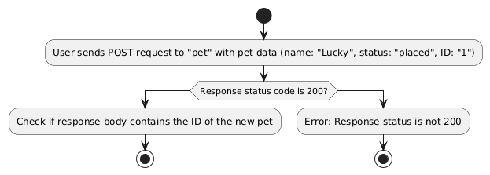

# Swagger Petstore API Automation Project

This project is a robust, end-to-end automation framework designed to rigorously test the Swagger Petstore API. Built using Java, RestAssured, Cucumber, and JUnit, it provides a comprehensive suite of automated tests that validate various aspects of the API's functionality. 

This includes not only core features like user and pet management but also more intricate operations such as searching pets by different criteria and managing user sessions. 

The framework utilizes a Behavior-Driven Development (BDD) approach, making test cases easy to read and understand, facilitating collaboration between technical and non-technical team members. By focusing on both happy path and error scenarios, this project aims to ensure the API's reliability and robustness. Furthermore, it incorporates advanced features such as environment variable handling, dynamic payload generation, and structured reporting, making it an excellent example of a well-rounded API automation solution. 

The project is designed for ease of use and extensibility, making it a valuable resource for anyone seeking to learn or enhance their API testing skills. It is a scalable and maintainable framework, capable of evolving with the requirements of the API being tested. The tests are organized into clear feature files, and the execution of tests can be managed through Maven profiles, offering flexibility for different testing needs and environments.

## Project Setup and Analysis

The initial setup involved getting the Swagger Petstore API running locally. Here's an overview of the steps taken:

1.  **Local Server Setup:** Initially, Docker was considered for running the API server. However, due to issues with enabling virtualization in the BIOS on a work computer, it was decided to use Jetty as suggested by the documentation.

2. **Steps to Run Swagger Petstore Sample Locally:**
    1.  Cloned the project from 'https://github.com/swagger-api/swagger-petstore.git'.
    2.  Installed Java.
    3.  Installed Maven using 'mvn clean install'.
    4.  Verified Maven version using 'mvn -version':
        *   Apache Maven 3.9.8 (36645f6c9b5079805ea5009217e36f2cffd34256)
        *   Maven home: C:\Program Files\apache-maven-3.9.8
        *   Java version: 22, vendor: Oracle Corporation, runtime: C:\Program Files\Java\jdk-22
        *   Default locale: en_US, platform encoding: UTF-8
        *   OS name: "windows 10", version: "10.0", arch: "amd64", family: "windows"
    5.  Executed the server using 'mvn package jetty:run'.
        *   Encountered an error in the 'src\main\resources\openapi-inflector.yaml\openapi.yaml' file. This was fixed by renaming the file to 'openapi-inflector.yaml'.
    6.  Tested the server by accessing 'http://localhost:8080/api/v3/openapi.json'.
        *   Confirmed the API collection was visible in the browser.
    7.  Exported the 'openapi.json' file.
    8.  Imported the 'openapi.json' file into Postman to understand the API methods, parameters, and payloads.
    9.  Created a QA environment in Postman to store the API URL: 'http://localhost:8080/api/v3'.
    10. Performed basic manual tests to understand the API's behavior.

## Project Structure

The project is organized to facilitate development, maintenance, and execution of automated tests. Here's a detailed breakdown of each relevant folder and file:

```plaintext
local-swagger-petstore-java-restassured/
├── .idea/                            # Configuration files for the IDE (e.g., IntelliJ IDEA).
├── src/                              # Source code of the project.
│   ├── main/                         # Main application code.
│   │   ├── java/org/example/         # Java classes.
│   │   │   ├── pages/                # Page classes for API interaction logic.
│   │   │   │   └── MethodsPage.java  # Class providing HTTP request methods.
│   │   │   ├── utils/                # Utility classes.
│   │   │   │   ├── DataGenerator.java           # Class for generating random data.
│   │   │   │   ├── EnvironmentConfiguration.java # Class for loading environment variables.
│   │   │   │   ├── GeneratePayloads.java        # Class for generating JSON request payloads.
│   │   │   │   └── GlobalVariables.java         # Class for storing global variables.
│   │   └── resources/                 # Resource files (e.g., properties).
│   │   └── .env                       # Environment variables file.
│   ├── test/                          # Test code.
│   │   ├── java/                      # Test code in Java.
│   │   │   ├── features/              # Feature files containing BDD scenarios.
│   │   │   │   ├── e2e/               # End-to-end test scenarios.
│   │   │   │   │   └── HU_UserManagementE2E.feature # Feature file for user management.
│   │   │   │   ├── integration/       # Integration test scenarios.
│   │   │   │   │   ├── sprint1/       # Integration tests for Sprint 1.
│   │   │   │   │   │   └── HU_AddOrUpdateAPetToTheStore.feature # Feature file for pet management.
│   │   │   │   │   └── sprint2/       # Integration tests for Sprint 2.
│   │   │   │   │   │   └── HU_SearchPetsByTagsAndStatus.feature # Feature file for pet search.
│   │   │   │   └── runners/           # Test runners for Cucumber tests.
│   │   │   │       └── TestRunner.java # Test runner class for Cucumber tests.
├── pom.xml                            # Maven project configuration file.

```

----------


## Features Covered

### End-to-End User Management (`HU_UserManagementE2E.feature`)
* **Objective:** Tests the complete user management flow in the Swagger Petstore API.
* **Functionality:**
    *   Creates a new user.
    *   Retrieves user details.
    *   Logs in a user.
    *   Logs out a user.
* **Tags:** `@happy-path`, `@e2e`

### Pet Management (`HU_AddOrUpdateAPetToTheStore.feature`)
* **Objective:** Tests the CRUD operations (Create, Read, Update, Delete) for pets in the Swagger Petstore API.
* **Functionality:**
    *   Adds pets with valid IDs.
    *   Updates an existing pet's status.
    *   Deletes a pet by ID.
* **Tags:** `@happy-path`, `@integration-test`, `@alternative-path`

### Search Pets by Criteria (`HU_SearchPetsByTagsAndStatus.feature`)
* **Objective:** Tests the ability to search for pets based on tags, status and ID.
* **Functionality:**
    *   Finds pets by valid tags.
    *   Handles searches with invalid tags.
    *   Finds pets by valid status.
    *   Handles searches with invalid status.
    *   Finds a pet by valid ID.
    *   Handles searches with invalid ID.
* **Tags:** `@happy-path`, `@integration-test`, `@error-path`

## Technical Details

### Technology Stack

*   **Java:** The core programming language used for test automation.
*   **RestAssured:** Library for simplifying the testing of REST APIs.
*   **Cucumber:** Framework for Behavior Driven Development (BDD) using Gherkin syntax for defining tests.
*   **JUnit:** Testing framework to run the tests.
*   **JavaFaker:** Library to generate realistic fake data.
*   **dotenv:** Library to load environment variables.
*   **Maven:** Build automation tool for managing project dependencies and test execution.

### Execution Profiles

This project uses Maven profiles to run tests based on different criteria, such as:

*   **`all-tests`**: Runs all tests in the project.
*   **`sad-paths`**: Runs tests that target error scenarios (tagged with `@error-path`).
*   **`happy-path`**: Runs tests from sprint 1 (tagged with `@happy-path`).
*   **`e2e`**: Runs tests for e2e (tagged with `@e2e`).
*   **`integration-test`**: Runs tests for integration tests (tagged with `@integration-test`).

These profiles are defined in the `pom.xml` file and can be selected when running tests via Maven.

### Utility Classes

The `src/main/java/utils` directory contains the following utility classes:

*   **`DataGenerator.java`**:
    *   Provides methods to generate random data including IDs, usernames, names, emails, passwords, and phone numbers using the JavaFaker library.
*   **`EnvironmentConfiguration.java`**:
    *   Loads environment variables from a `.env` file using the `dotenv` library.
    *   Provides a method to access environment variables by their keys.
*   **`GeneratePayloads.java`**:
    *   Generates JSON payloads for creating and updating pets and users.
    *   Includes methods to create payloads with specific details such as name, status, ID for pets, and user attributes like username, name, email, password, and phone number.
*   **`GlobalVariables.java`**:
    *   Provides static variables to store global values such as pet ID and status, which can be shared across different parts of the test suite.

### `MethodsPage.java`

This class (located in `src/main/java/org/example/pages`) provides methods for making HTTP requests, including:

*   `makeRequestPost(String endpoint, String payload)`: Sends a POST request with the provided payload.
*   `makeRequestPut(String endpoint, String payload)`: Sends a PUT request with the provided payload.
*   `makeRequestDelete(String endpoint)`: Sends a DELETE request.
*   `makeRequestGet(String endpoint)`: Sends a GET request.

It handles common configurations such as `Content-Type`, `Accept` headers. The base URL for the API is loaded from environment configuration via `EnvironmentConfiguration.getEnvironmentVariable("BASE_URL")`.

## How to Run the Tests

1.  **Clone the repository:**
    ```bash
    git clone <repository-url>
    ```

2.  **Navigate to the project directory:**
    ```bash
    cd <project-directory>
    ```

3.  **Set up environment variables** Create a `.env` file in the project's root directory and add your environment variables (e.g., `BASE_URL=http://localhost:8080/api/v3`).

4.  **Run the tests** You can run your tests using your IDE or Maven. Below are some example commands:

**Execution Commands:**
-   **Run all tests:**
    ```bash
    mvn clean test -P all-tests
    ```
-   **Run sad path tests:**
    ```bash
    mvn clean test -P sad-paths
    ```
-   **Run tests for a specific sprint:**
    ```bash
    mvn clean test -P sprint1
    mvn clean test -P sprint2
    mvn clean test -P sprint3
    ```
-   **Run all tests and generate Allure report:**
    ```bash
    mvn clean test -P all-tests; mvn allure:report; allure serve target/allure-results
    ```

## Reporting

After running the tests, you will find a report on the target directory.

## Test Strategies

The test strategies are designed to validate the functionality of the Swagger Petstore API in different scenarios, covering both happy and error paths to ensure the service's stability and reliability. These tests are divided into End-to-End (E2E) and integration tests, distributed by specific functionalities:

### End-to-End Tests

1.  **`HU_UserManagementE2E.feature`**
    *   **Objective:** Validate the complete user management flow, from user creation to logout.
    *   **Scenarios:**
        *   Successfully creates a user.
        *   Successfully retrieves the user's details.
        *   Successfully logs in a user.
        *   Successfully logs out a user.

### Integration Tests

1.  **`HU_AddOrUpdateAPetToTheStore.feature`**
    *   **Objective:** Validate the stability of the service and data persistence when adding, updating and deleting pets.
    *   **Scenarios:**
        *   Successfully adds a pet with a valid ID.
        *   Successfully updates an existing pet's status.
        *   Successfully deletes a pet with a valid ID.

2.  **`HU_SearchPetsByTagsAndStatus.feature`**
    *   **Objective:** Verify the functionality of the API to search for pets based on different criteria.
    *   **Scenarios:**
        *   Finds pets by valid tags.
        *   Handles searches with invalid tags.
        *   Finds pets by valid status.
        *   Handles searches with invalid status.
        *    Finds a pet by a valid ID.
        *   Handles searches with an invalid ID.

Each `.feature` file includes tagged scenarios to facilitate organization and execution in automated test suites. The tags used help to differentiate happy paths (`@happy-path`) from error paths (`@error-path`) and to group tests by type (`@e2e`, `@integration-test`) and sprint (`@sprint1`, `@sprint2`, `@sprint3`).

## Flowcharts
-  **`HU_AddOrUpdateAPetToTheStore.feature`**



-  **`HU_SearchPetsByTagsAndStatus.feature`**


-  **`HU_UserManagementE2E.feature`**


## Final report (Allure)


## Developed By

This project was developed by [Nicolas Ortiz](https://www.linkedin.com/in/ortiznicolas/).

### Contact Information:
- **LinkedIn**: [https://www.linkedin.com/in/ortiznicolas/](https://www.linkedin.com/in/ortiznicolas/)
- **Email**: vinico0911@hotmail.com
- **Mobile**: +573215105973

## Contributing

Feel free to contribute to the project by creating pull requests, reporting issues, or suggesting improvements.